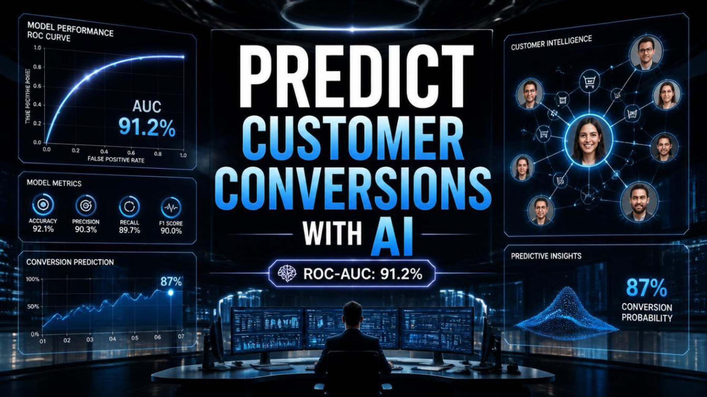
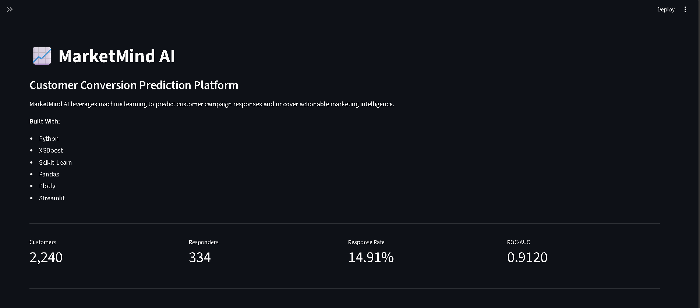
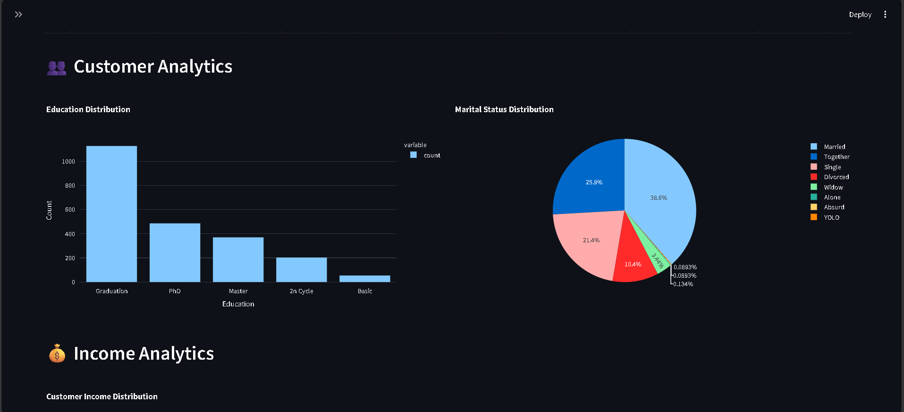
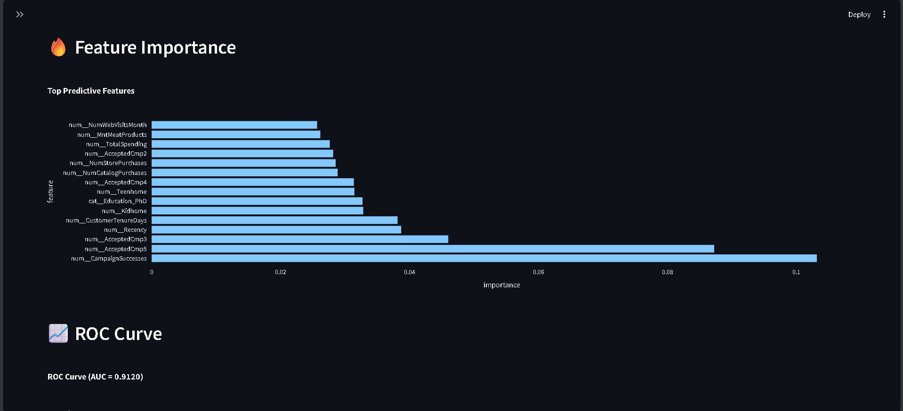

# MarketMind AI

## AI-Powered Customer Conversion Prediction and Marketing Intelligence Platform

<div align="center">

<h3>🎬 Project Trailer</h3>

<p>
Watch the cinematic walkthrough of MarketMind AI, including the business problem,
machine learning pipeline, model evaluation, and interactive analytics dashboard.
</p>

<a href="https://youtu.be/TXMZTwVUdOc">
    
</a>

<br><br>

<a href="https://youtu.be/TXMZTwVUdOc">
    
</a>

<a href="YOUR_STREAMLIT_LINK_HERE">
    
</a>

<a href="linkedin.com/in/friday-ogbonna-amos-a62a5636b">
    
</a>

</div>

---

# Abstract

Modern marketing campaigns generate enormous volumes of customer data, yet many organizations still rely on intuition and broad demographic assumptions when allocating marketing resources. This often leads to inefficient spending, poor campaign performance, and missed revenue opportunities.

MarketMind AI was developed as an applied machine learning research project focused on predicting customer conversion behavior using demographic, behavioral, and transactional marketing data.

The system leverages advanced feature engineering and Extreme Gradient Boosting (XGBoost) to identify patterns associated with successful customer responses to marketing campaigns. The resulting model enables organizations to prioritize high-probability customers, optimize campaign targeting, and improve marketing efficiency through data-driven decision-making.

Beyond model development, the project includes a fully interactive Streamlit analytics dashboard that transforms predictive outputs into actionable business intelligence for marketers and decision-makers.

---

# Research Motivation

Marketing remains one of the most data-rich yet prediction-poor functions in modern business.

Organizations collect extensive information regarding:

- Customer demographics
- Purchase history
- Campaign engagement
- Website interactions
- Product preferences

Despite this abundance of information, campaign targeting frequently relies on simplistic segmentation approaches that fail to capture complex behavioral relationships.

This project investigates whether machine learning can effectively model these relationships and improve conversion prediction accuracy.

The research question guiding this project is:

> Can customer demographic, transactional, and behavioral signals be combined through machine learning to accurately predict campaign response outcomes?

---

# Project Objectives

The primary objectives were:

- Develop a reliable customer conversion prediction model.
- Engineer meaningful behavioral features from raw marketing data.
- Evaluate predictive performance using industry-standard metrics.
- Identify the most influential drivers of campaign response.
- Create an interactive analytics platform for business stakeholders.
- Demonstrate the practical application of AI in marketing decision-making.

---

# Dataset Overview

The project utilizes a customer marketing campaign dataset containing demographic, purchasing, and campaign engagement variables.

### Dataset Characteristics

| Attribute | Value |
|------------|---------|
| Records | 2,240 Customers |
| Original Features | 29 |
| Engineered Features | 33 |
| Target Variable | Campaign Response |
| Positive Class | Customer Converted |
| Negative Class | Customer Did Not Convert |

---

# Feature Engineering

Several business-oriented features were engineered to improve predictive capability.

### Engineered Variables

| Feature | Description |
|----------|-------------|
| Age | Customer Age |
| TotalChildren | Total Number of Children |
| TotalSpending | Aggregate Product Spending |
| TotalPurchases | Total Purchase Activity |
| CampaignSuccesses | Historical Campaign Acceptance Count |
| CustomerTenureDays | Customer Relationship Duration |

Feature engineering significantly improved the model's ability to capture customer value, engagement behavior, and purchasing tendencies.

---

# Machine Learning Methodology

## Model Selection

The project utilizes:

### Extreme Gradient Boosting (XGBoost)

XGBoost was selected because of its:

- High predictive performance
- Ability to model nonlinear relationships
- Robust handling of mixed feature types
- Strong generalization capabilities
- Proven success in structured tabular datasets

---

## Modeling Pipeline

```text
Raw Dataset
     │
     ▼
Data Cleaning
     │
     ▼
Feature Engineering
     │
     ▼
Train/Test Split
     │
     ▼
XGBoost Training
     │
     ▼
Model Evaluation
     │
     ▼
Business Intelligence Dashboard
```

---

# Model Performance

The trained XGBoost model achieved strong predictive performance.

| Metric | Score |
|----------|----------|
| Accuracy | 89.96% |
| Precision | 68.33% |
| Recall | 61.19% |
| F1 Score | 64.57% |
| ROC-AUC | 91.20% |

---

## Confusion Matrix

```text
[[362  19]
 [ 26  41]]
```

The model demonstrates strong discriminatory power while maintaining a balanced trade-off between false positives and false negatives.

---

# Key Predictive Drivers

Feature importance analysis identified several variables with significant influence on campaign response prediction.

### Top Features

- CampaignSuccesses
- AcceptedCmp5
- AcceptedCmp3
- Recency
- CustomerTenureDays
- Kidhome
- Education (PhD)
- Teenhome
- AcceptedCmp4
- NumCatalogPurchases

These findings suggest that prior campaign engagement and purchasing behavior are among the strongest indicators of future conversion likelihood.

---

# Dashboard Overview

MarketMind AI includes a fully interactive Streamlit application for real-time exploration of customer data and predictive insights.

---

## Dashboard Overview



---

## Customer Analytics



---

## Model Insights



---

# Applications

The system can support:

### Marketing Teams

- Campaign Optimization
- Customer Segmentation
- Budget Allocation
- Lead Prioritization

### Business Intelligence Teams

- Customer Analytics
- Performance Monitoring
- Revenue Forecasting
- Behavioral Analysis

### Data Science Teams

- Predictive Modeling
- Feature Analysis
- Model Explainability
- Decision Support Systems

---

# Technology Stack

### Programming

- Python

### Machine Learning

- XGBoost
- Scikit-Learn

### Data Processing

- Pandas
- NumPy

### Visualization

- Plotly
- Matplotlib

### Deployment

- Streamlit

---

# Project Structure

```text
MarketMind_AI/
│
├── assets/
│   ├── marketmind_customer_analytics.png
│   ├── marketmind_dashboard_overview.png
│   ├── marketmind_model_insights.png
│   └── marketmind_thumbnail.png
│
├── data/
│   └── marketing_campaign.csv
│
├── models/
│   ├── feature_importance.csv
│   ├── marketmind_xgb.pkl
│   ├── model_metrics.pkl
│   └── roc_curve.csv
│
├── processed/
│   ├── clean_marketing.csv
│   └── engineered_marketing.csv
│
├── app.py
├── feature_engineering.py
├── inspect_columns.py
├── inspect_dataset.py
├── prepare_data.py
├── README.md
├── save_metrics.py
└── train_xgboost.py
```

---

# Future Research Directions

Potential future enhancements include:

- Hyperparameter Optimization
- SHAP Explainability Analysis
- Customer Lifetime Value Prediction
- Multi-Class Campaign Outcome Modeling
- Deep Learning Approaches
- Real-Time Prediction APIs
- Automated Marketing Recommendation Systems

---

# Conclusion

MarketMind AI demonstrates how machine learning can transform customer data into actionable marketing intelligence.

By integrating feature engineering, predictive modeling, and interactive analytics, the project provides a practical framework for supporting evidence-based marketing decisions.

The results highlight the potential of AI-driven customer analytics to improve campaign effectiveness, reduce wasted marketing expenditure, and strengthen organizational decision-making.

---

# Author

## Amos Friday Ogbonna

AI & Machine Learning Practitioner  
Marketing Technology Strategist  
Python Developer

This project was developed as part of a broader effort to explore the intersection of Artificial Intelligence, Predictive Analytics, and Business Decision Intelligence.

---

## License

This project is licensed under the MIT License.
